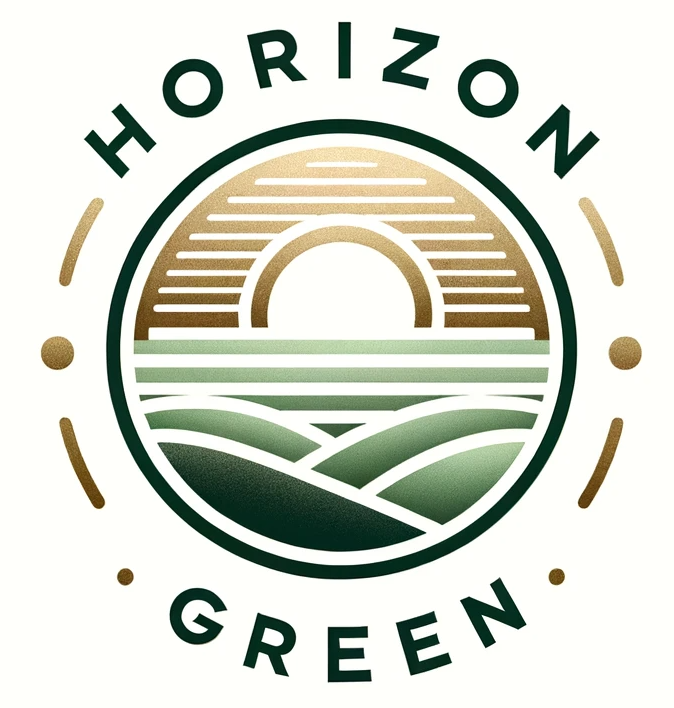

  

# EB1A 杰出人才 + NIW 国家利益豁免 绿卡准备指南

由**地平线**和**山雪**编写，免费公开，原创首发于 [HorizonGreen.org](https://horizongreen.org/)

---

## 下载指南

📥 [**地平线EB1A+NIW绿卡DIY指南-山雪_2026.02.pdf**](https://github.com/HorizonGreen/EB1A-NIW-Guidance/blob/main/%E5%9C%B0%E5%B9%B3%E7%BA%BFEB1A%2BNIW%E7%BB%BF%E5%8D%A1DIY%E6%8C%87%E5%8D%97-%E5%B1%B1%E9%9B%AA_2026.02.pdf)

2025-2026 年 NIW 和 EB1A 的审理标准发生了实质性变化：NIW 批准率从 96% 降至 54%，EB1A 第二关（Final Merits）成为真正的筛选门槛，SCOPS 全国统一调度让押中心、押时间的策略彻底失效。材料质量成为唯一变量。

本次更新基于最新 RFE 趋势、3,800+ 份 AAO 判例分析和过去一年实际经手的案例经验。

---

## 3,866+ 份 AAO 判例分析

我们系统分析了行政上诉办公室（AAO）的 **3,866 份判例**，拆解了每一个被拒案例的证据缺陷和裁决逻辑。覆盖 EB1A 和 NIW 的所有主流领域，是目前公开可查的最完整的 AAO 判例分析库。

无论您准备 DIY 还是委托写作，这些判例分析都能帮您理解移民局真正在看什么、为什么拒、怎么避免同样的问题。

➡️ [在线浏览 AAO 判例库](https://horizongreen.org/AAO/)

---

## 定制委托写作

不想 DIY？我们提供免费评估和全套定制写作服务。

**地平线**负责全套申请材料：阅读分析背景材料，深度挖掘证据链逻辑，突出贡献亮点，整理论文、专利、引用记录，联系领域内推荐人。所有材料不用模版，无需您自己写研究总结。曾发表 50+ 篇论文，理解学术和工业研究的表达方式。

**山雪**具有医学科研与创业双重背景，已通过 NIW，撰写过科创白皮书。熟悉 NIW 与 EB1A 的政策逻辑、审理标准与材料撰写。

➡️ [查看通过案例](https://horizongreen.org/通过案例/)

---

## 联系我们

|  | 微信 | 小红书 |
|---|---|---|
| **地平线** | eb1a_horizon | [@地平线](https://www.xiaohongshu.com/user/profile/5fb60b030000000001002437) |
| **山雪** | SnowMount_29 | [@Mount Snow](https://xhslink.com/m/AlycYOpwA1c) |

- 🌐 Website: [horizongreen.org](https://horizongreen.org/)
- 📧 Email: [horizongreen1@gmail.com](mailto:horizongreen1@gmail.com)

  
  &nbsp;&nbsp;&nbsp;
  

---

## 许可

本指南采用 [CC BY-NC 4.0 DEED](https://creativecommons.org/licenses/by-nc/4.0/) 进行许可。

> ⚠️ 已发现有不少中介在社交平台上篡改作者名字、洗稿、抄袭本指南并谎称为原创后售卖。欢迎顺手举报并联系作者。

## Disclaimer

I am a scientist, not a lawyer. The contents of this repository are provided for educational purposes only and are not intended to substitute for professional legal advice. Any use of this information is done at your own discretion and risk.
